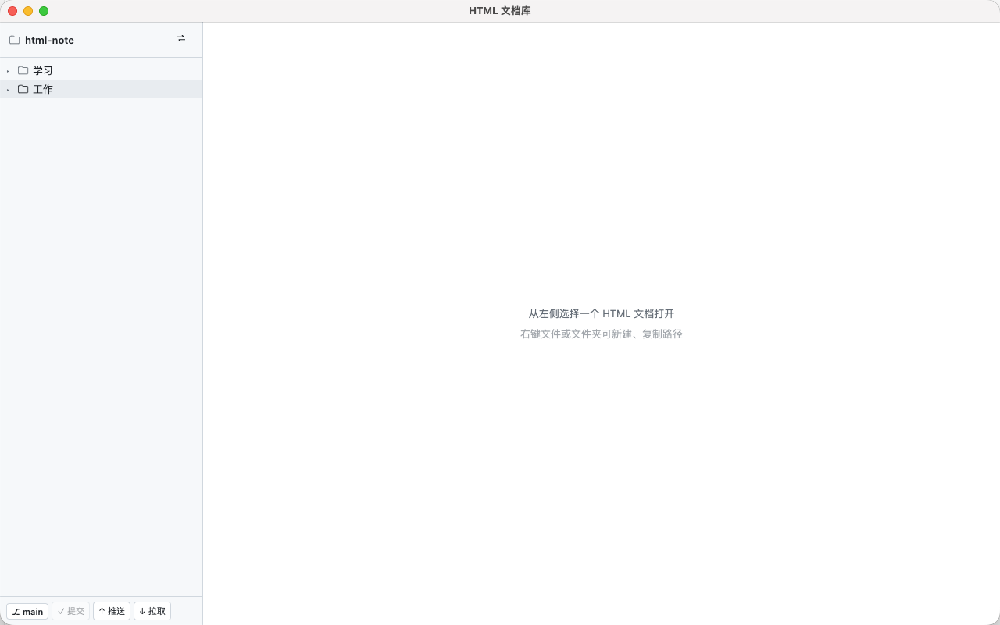
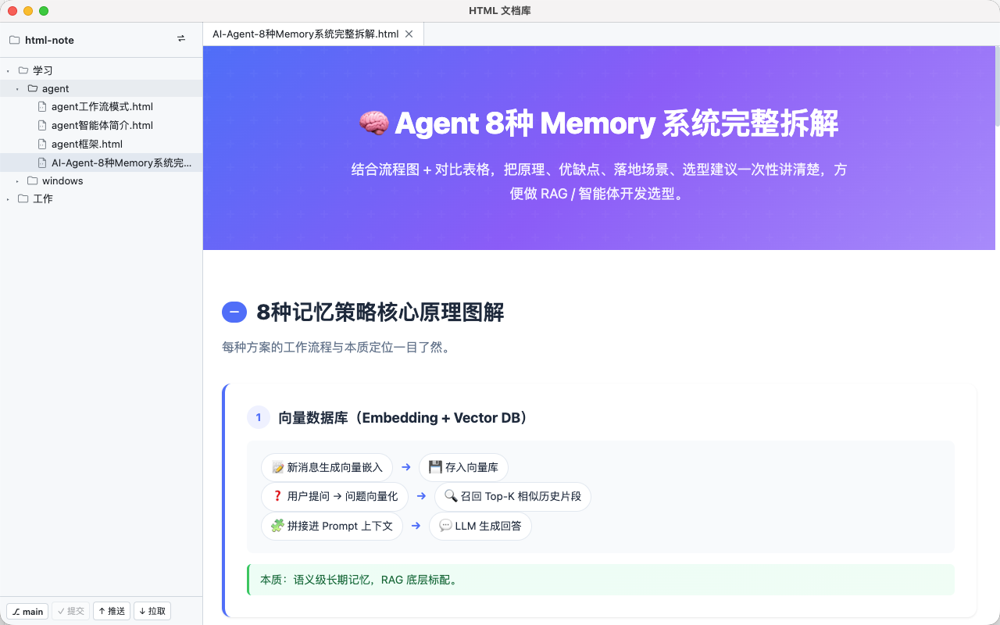
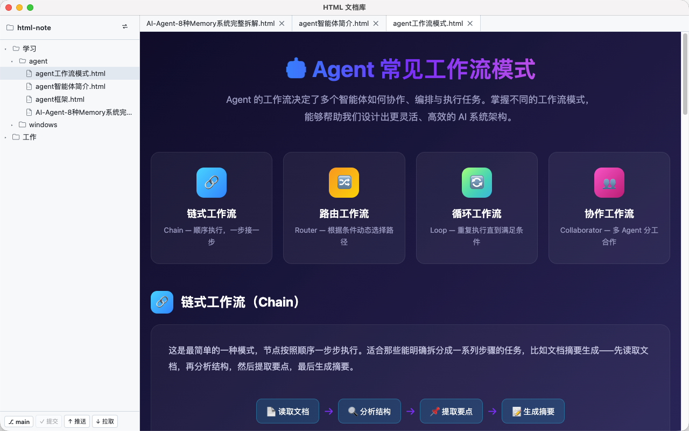

# HTML 文档库

AI 时代，我们产出了大量 HTML 格式的文档。Markdown 有 Obsidian、Typora 等专门工具，但 HTML 文档只能在浏览器里打开，缺乏统一的管理和浏览工具。HTML 文档库就是为解决这个问题而生的本地客户端。

## 截图







## 功能

- 📁 **文档库**：选择本地文件夹作为 Vault，自动记忆上次打开
- 📄 **HTML 预览**：双击即渲染，默认预览模式，无需切换编辑器
- 🌳 **文件树**：新建目录/文档、重命名、删除、拖拽移动
- 👀 **文件监听**：外部程序（AI、编辑器）写入后自动刷新预览
- 🔗 **复制路径**：右键一键复制绝对路径，粘贴给 AI 写内容
- 🌿 **Git 同步**：内置 commit / push / pull，提交前可查看变更文件、单文件还原
- 🎨 **亮色主题**：简洁明亮的界面

## 使用场景

1. 在软件里新建空 HTML 文件
2. 复制文件路径给 AI
3. AI 写好内容落盘，软件自动刷新预览
4. Git 一键提交推送到远程仓库

## 开发

```bash
npm install
npm run dev
```

## 打包

```bash
npm run dist
```

产物在 `release/mac-arm64/`。

## 技术栈

- Electron
- Vue 3 + Vite
- chokidar（文件监听）

## License

[MIT](LICENSE) © mtain
